

  <button class="tablinks" onclick="openTab(event, 'WorkEngagements')" id="defaultOpen">Bio and Work Engagements</button>
  <button class="tablinks" onclick="openTab(event, 'OpenSource')">Open Source</button>
  <button class="tablinks" onclick="openTab(event, 'SelectedPapers')">Selected Papers</button>
  <button class="tablinks" onclick="openTab(event, 'Patents')">Selected Patents</button>
  <button class="tablinks" onclick="openTab(event, 'Education')">Education</button>
  <button class="tablinks" onclick="openTab(event, 'Mentoring')">Mentoring</button>

## Bio

Prior to 2015, my research focused on pure mathematics and theoretical computer science, covering logic, foundations, game theory, and optimization. I subsequently pivoted to work exclusively on machine learning. Throughout my career, I have been fortunate to interact with leadership that supported new research directions and collaborate with exceptional researchers who made it possible to pursue these directions.

Before joining Google in 2019, I worked on [reinforcement learning for theorem proving](https://proceedings.neurips.cc/paper/8098-reinforcement-learning-of-theorem-proving.pdf), a [sim2real project with Volkswagen](https://www.mimuw.edu.pl/~henrykm/pubs_2019/sim2real_outdoor.pdf), and [model-based RL](https://arxiv.org/abs/1903.00374). At Google, I have contributed to [PaLM](https://arxiv.org/abs/2204.02311), [early program synthesis work with LLMs](https://arxiv.org/abs/2108.07732), [Scratchpad](https://arxiv.org/abs/2112.00114), and [Minerva](https://arxiv.org/abs/2206.14858). More recently, I worked on the [math-specialized model presented in the Gemini 1.5 report](https://storage.googleapis.com/deepmind-media/gemini/gemini_v1_5_report.pdf), [Big Sleep](https://googleprojectzero.blogspot.com/2024/10/from-naptime-to-big-sleep.html), [AlphaProof](https://www.nature.com/articles/s41586-025-09833-y), and all iterations of the main Gemini models. Leveraging Google’s infrastructure, I have conducted thousands of experiments and submitted over 1,000 pull requests—roughly half of which were to the Gemini codebase.

## Work Engagements

  

    
  

  

    
Senior Staff Research Scientist

    
<em>Google DeepMind, 2025–present</em>

  

 

  

    
  

  

    
Staff Research Scientist

    
<em>Google DeepMind, 2023–2025</em>

  

 

  

    
  

  

    
Staff Research Scientist

    
<em>Google Brain, 2021–2023</em>

  

 

  

    
  

  

    
Leverhulme Fellow

    
<em>Department of Computer Science, University of Oxford, 2021–2022</em>

  

 

  

    
  

  

    
Visiting Researcher (Staff Faculty Visiting Researcher)

    
<em>Google, 2019–2021</em>

  

 

  

    
  

  

    
Visiting Researcher

    
<em>Department of Computer Science, University of Oxford, 2018–2019</em>

  

 

  

    
  

  

    
Invited Professor

    
<em>École normale supérieure de Lyon, 2017</em>

  

 

  

    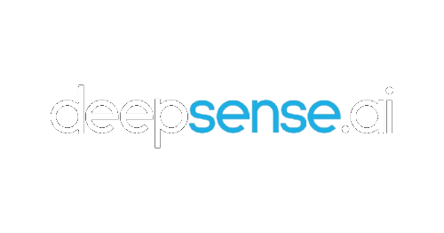
  

  

    
Data Scientist

    
<em>deepsense.ai, 2016–2019</em>

  

 

  

    
  

  

    
Associate Professor (last held position)

    
<em>University of Warsaw, 2007–present, on a long term leave since 2016</em>

  

 

  

    
  

  

    
Postdoctoral Researcher

    
<em>Ben-Gurion University, Israel, 2004–2007</em>

  

## Open Source Contributions

- **[Trax](https://github.com/google/trax)** — contributions to sequence modeling, training pipelines, and reasoning-focused components.  
- **[Formal Putnam-like Benchmark](https://github.com/google-deepmind/formal-putnam-like)** — co-developer of an olympiad-level mathematical reasoning evaluation suite.  
- **[Eval-Hub](https://github.com/google-deepmind/eval_hub)** — contributor to a unified evaluation framework for LLM reasoning, code generation, and multimodal tasks.  

  

    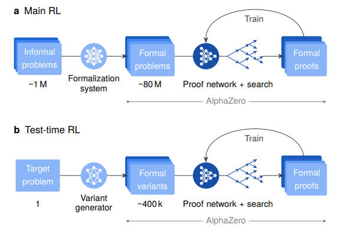
  

  

    
<a href="https://www.nature.com/articles/s41586-025-09833-y">Olympiad-level formal mathematical reasoning with reinforcement learning</a>

    
<em>Nature 2025</em>

    

      <a href="https://www.nature.com/articles/s41586-025-09833-y_reference.pdf" class="btn btn-sm z-depth-0" role="button" target="_blank" style="font-size:12px;">PDF</a>
    

  

 

  

    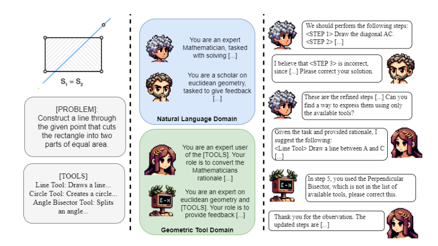
  

  

    
<a href="https://aclanthology.org/2024.findings-emnlp.360/">Beyond Lines and Circles: Unveiling the Geometric Reasoning Gap in Large Language Models</a>

    
<em>EMNLP 2024</em>

    

      <a href="https://aclanthology.org/2024.findings-emnlp.360/" class="btn btn-sm z-depth-0" role="button" target="_blank" style="font-size:12px;">PDF</a>
    

  

 

  

    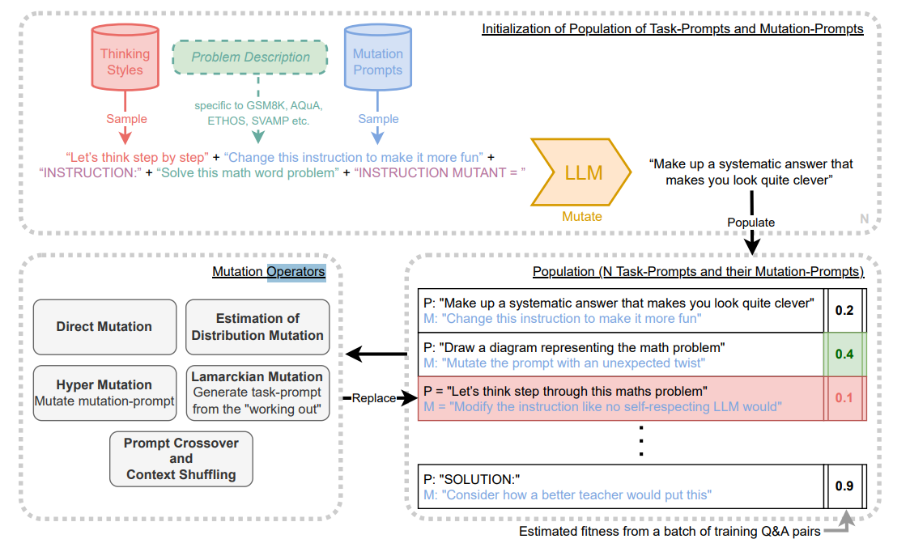
  

  

    
<a href="https://icml.cc/virtual/2024/poster/34801">Promptbreeder: Self-Referential Self-Improvement via Prompt Evolution</a>

    
<em>ICML 2024</em>

    

      <a href="https://icml.cc/virtual/2024/poster/34801" class="btn btn-sm z-depth-0" role="button" target="_blank" style="font-size:12px;">PDF</a>
    

  

 

  

    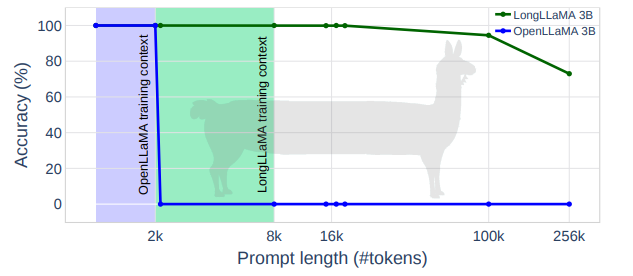
  

  

    
<a href="https://openreview.net/forum?id=s1FjXzJ0jy&noteId=PjanKdC3Ka">Focused Transformer: Contrastive Training for Context Scaling</a>

    
<em>NeurIPS 2023</em>

    

      <a href="https://openreview.net/forum?id=s1FjXzJ0jy&noteId=PjanKdC3Ka" class="btn btn-sm z-depth-0" role="button" target="_blank" style="font-size:12px;">PDF</a>
    

  

 

  

    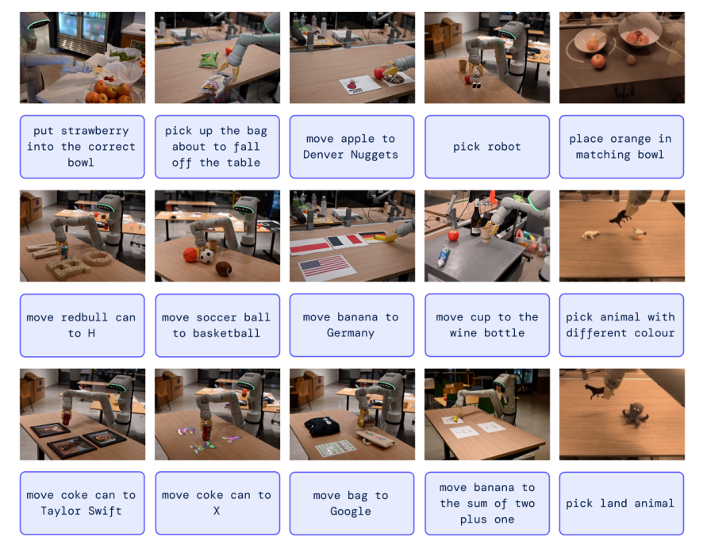
  

  

    
<a href="https://arxiv.org/abs/2307.15818">RT-2: Vision-Language-Action Models Transfer Web Knowledge to Robotic Control</a>

    
<em>ArXiv 2023</em>

    

      <a href="https://arxiv.org/abs/2307.15818" class="btn btn-sm z-depth-0" role="button" target="_blank" style="font-size:12px;">PDF</a>
    

  

 

  

    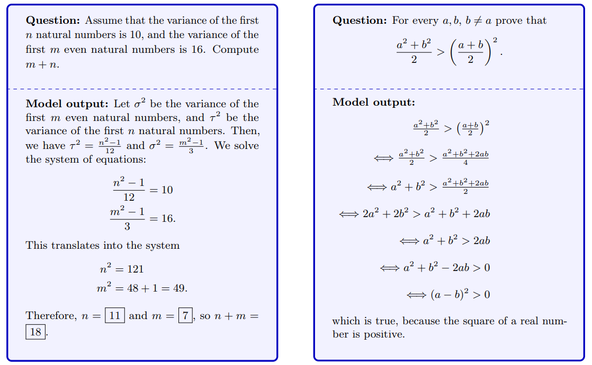
  

  

    
<a href="https://papers.nips.cc/paper_files/paper/2022/hash/18abbeef8cfe9203fdf9053c9c4fe191-Abstract-Conference.html">Solving Quantitative Reasoning Problems with Language Models</a>

    
<em>NeurIPS 2022</em>

    

      <a href="https://papers.nips.cc/paper_files/paper/2022/hash/18abbeef8cfe9203fdf9053c9c4fe191-Abstract-Conference.html" class="btn btn-sm z-depth-0" role="button" target="_blank" style="font-size:12px;">PDF</a>
    

  

 

  

    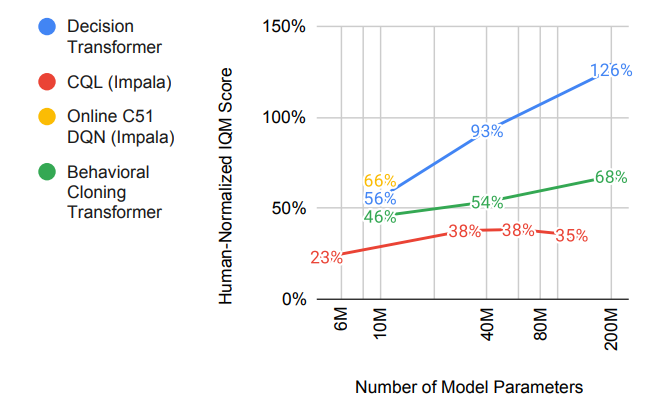
  

  

    
<a href="https://arxiv.org/abs/2205.15241">Multi-Game Decision Transformers</a>

    
<em>ArXiv 2022</em>

    

      <a href="https://arxiv.org/abs/2205.15241" class="btn btn-sm z-depth-0" role="button" target="_blank" style="font-size:12px;">PDF</a>
    

  

 

  

    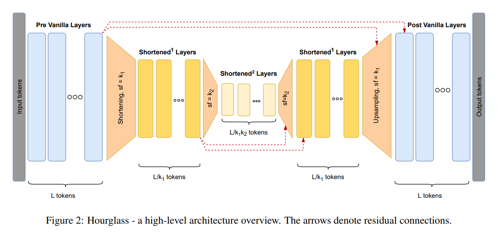
  

  

    
<a href="https://aclanthology.org/2022.findings-naacl.117/">Hierarchical Transformers Are More Efficient Language Models</a>

    
<em>NAACL 2022 (Findings)</em>

    

      <a href="https://aclanthology.org/2022.findings-naacl.117/" class="btn btn-sm z-depth-0" role="button" target="_blank" style="font-size:12px;">PDF</a>
    

  

 

  

    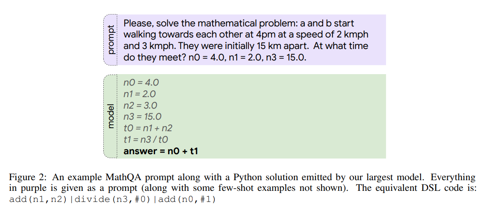
  

  

    
<a href="https://arxiv.org/abs/2108.07732">Program Synthesis with Large Language Models</a>

    
<em>ArXiv 2021</em>

    

      <a href="https://arxiv.org/abs/2108.07732" class="btn btn-sm z-depth-0" role="button" target="_blank" style="font-size:12px;">PDF</a>
    

  

 

  

    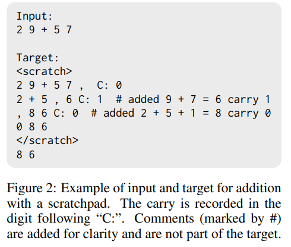
  

  

    
<a href="https://arxiv.org/abs/2112.00114">Show Your Work: Scratchpads for Intermediate Computation with Language Models</a>

    
<em>ArXiv 2021</em>

    

      <a href="https://arxiv.org/abs/2112.00114" class="btn btn-sm z-depth-0" role="button" target="_blank" style="font-size:12px;">PDF</a>
    

  

 

  

    
  

  

    
<a href="https://papers.nips.cc/paper/8098-reinforcement-learning-of-theorem-proving">Reinforcement Learning of Theorem Proving</a>

    
<em>NeurIPS 2018</em>

    

      <a href="https://papers.nips.cc/paper/8098-reinforcement-learning-of-theorem-proving" class="btn btn-sm z-depth-0" role="button" target="_blank" style="font-size:12px;">PDF</a>
    

  

 

  

    
  

  

    
<a href="https://www.mimuw.edu.pl/~henrykm/pubs_2019/sim2real_outdoor.pdf">Sim2Real Autonomous Driving</a>

    
<em>ICRA 2020</em>

    

      <a href="https://www.mimuw.edu.pl/~henrykm/pubs_2019/sim2real_outdoor.pdf" class="btn btn-sm z-depth-0" role="button" target="_blank" style="font-size:12px;">PDF</a>
    

  

 

  

    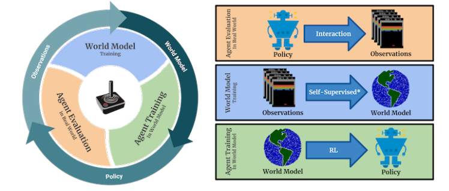
  

  

    
<a href="https://arxiv.org/abs/1903.00374">Model-Based RL for Atari</a>

    
<em>ICLR 2020</em>

    

      <a href="https://arxiv.org/abs/1903.00374" class="btn btn-sm z-depth-0" role="button" target="_blank" style="font-size:12px;">PDF</a>
    

  

 

  

    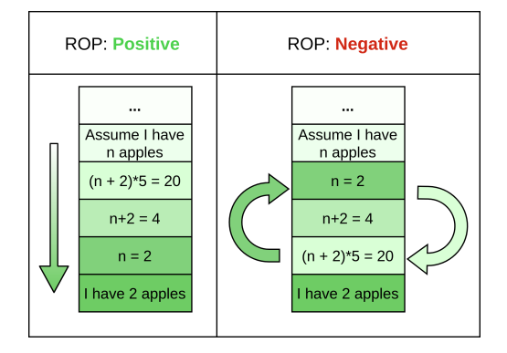
  

  

    
<a href="https://arxiv.org/abs/2106.03921">Measuring and Improving BERT’s Mathematical Abilities by Predicting the Order of Reasoning</a>

    
<em>ACL 2021</em>

    

      <a href="https://arxiv.org/abs/2106.03921" class="btn btn-sm z-depth-0" role="button" target="_blank" style="font-size:12px;">PDF</a>
    

  

 

  

    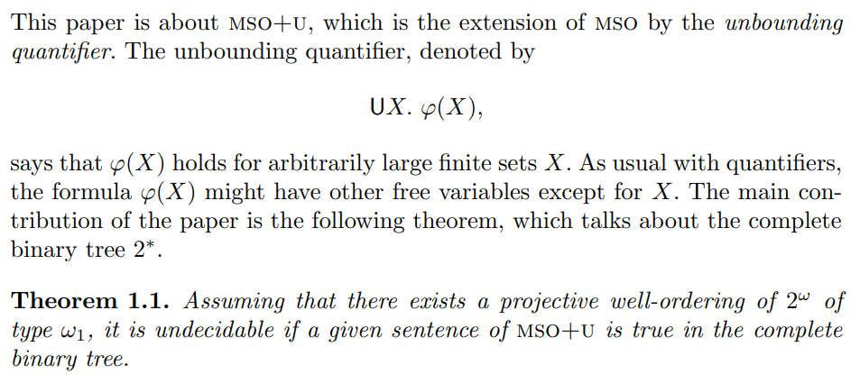
  

  

    
<a href="https://link.springer.com/chapter/10.1007/978-3-662-43951-7_5">MSO+U on Infinite Trees</a>

    
<em>ICALP 2014</em>

    

      <a href="https://link.springer.com/chapter/10.1007/978-3-662-43951-7_5" class="btn btn-sm z-depth-0" role="button" target="_blank" style="font-size:12px;">PDF</a>
    

  

 

  

    
  

  

    
<a href="https://arxiv.org/abs/1508.06780">Logical Strength of Rabin’s Theorem</a>

    
<em>LICS 2015</em>

    

      <a href="https://arxiv.org/abs/1508.06780" class="btn btn-sm z-depth-0" role="button" target="_blank" style="font-size:12px;">PDF</a>
    

  

 

## Patents based on the [Scratchpad paper](https://arxiv.org/abs/2112.00114) contributions

- [Prompting Machine-Learned Models Using Chains of Thought](https://patents.google.com/patent/US20230394328A1/en) — chain-of-thought prompting and consistency-based selection of model outputs for improved reasoning robustness.  

- [Using Chains of Thought to Prompt Machine-Learned Models Pre-Trained on Diversified Objectives](https://patents.google.com/patent/US20230244938A1/en) — construction of instructive query–answer–reasoning triples for steering large pre-trained models via chain-of-thought prompts.
  

## Education

  

    
  

  

    
Habilitation in Computer Science

    
<em>University of Warsaw, 2015</em>

    

      <a href="http://duch.mimuw.edu.pl/~henrykm/pubs_other/autoreferat_en.pdf" class="btn btn-sm z-depth-0" role="button" target="_blank" style="font-size:12px;">Thesis</a>
    

  

 

  

    
  

  

    
Internship

    
<em>Fields Institute, Toronto, Winter 2002</em>

  

 

  

    
  

  

    
PhD in Mathematics

    
<em>University of Warsaw, 1998–2002</em>

    

      <a href="http://duch.mimuw.edu.pl/~henrykm/pubs_other/phd_thesis.ps" class="btn btn-sm z-depth-0" role="button" target="_blank" style="font-size:12px;">Thesis</a>
    

  

 

  

    
  

  

    
Internship

    
<em>Vrije University, Amsterdam, 1998</em>

  

 

  

    
  

  

    
MA in Mathematics

    
<em>University of Warsaw, 1993–1998</em>

    

      <a href="https://www.mimuw.edu.pl/~henrykm/pubs_other/ma_thesis.pdf" class="btn btn-sm z-depth-0" role="button" target="_blank" style="font-size:12px;">Thesis</a>
    

  

## Mentoring of Students

[Spyridon Mouselinos](https://spyrosmouselinos.github.io/), 2021–2025, Ph.D. project  
*[Towards Visual Reasoning](https://sites.google.com/view/visualreasoning/home)*,  
co-supervised with Mateusz Malinowski (Google DeepMind).

[Cécilia Pradic](https://www.swansea.ac.uk/staff/c.pradic/#publications=is-expanded), 2014–2019, PhD thesis  
*[Some proof-theoretical approaches to Monadic Second-Order logic](https://theses.hal.science/tel-02954006v1)*,  
co-supervised with [Colin Riba](https://perso.ens-lyon.fr/colin.riba/) (ENS Lyon).

